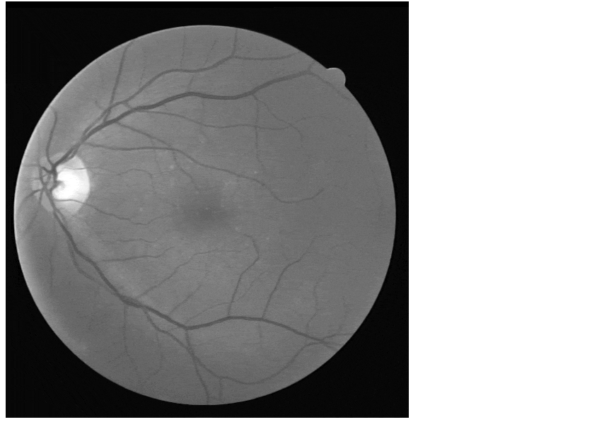

# 👁️ Extração de Vasos Sanguíneos em Imagens de Retinopatia Diabética

> **Trabalho de Visão Computacional focado na segmentação da árvore vascular para auxílio ao diagnóstico oftalmológico.**


---

## 👥 Integrantes
* **Cauê Pais Justo**
* **Davi Paulino Conceição**

---

## 📝 Sobre o Trabalho
A segmentação de vasos sanguíneos da retina é fundamental para identificar doenças como retinopatia diabética, glaucoma e hipertensão. O projeto visa automatizar a extração dessas estruturas para modelar matematicamente sua geometria e permitir a quantificação objetiva da **tortuosidade** (grau de curvatura).

---

## 🎬 Processo em Execução
Para facilitar a visualização do pipeline de processamento, criamos uma animação que demonstra a transição entre as etapas:

<p align="center">
  
</p>

> **Legenda:** Original ⮕ Canal Verde ⮕ CLAHE ⮕ Máscara Final.

---

## 🛠️ Metodologia
O fluxo de processamento foi dividido nas seguintes etapas técnicas:

1.  **Pré-processamento (Canal Verde):** Extração do canal verde por apresentar maior absorção de luz pela hemoglobina e melhor contraste.
2.  **Realce Espacial (CLAHE):** Aplicação de Equalização Adaptativa de Histograma Limitada por Contraste para realçar estruturas vasculares finas.
3.  **Segmentação (Limiarização):** Conversão da imagem realçada em uma máscara binária para separar os vasos do fundo da retina.
4.  **Avaliação Quantitativa:** Comparação pixel a pixel com o **Ground Truth** (padrão-ouro) para calcular métricas de desempenho.

---

## 📊 Resultados
Os testes foram realizados utilizando dois limiares diferentes para avaliar o impacto na segmentação:

| Métrica | Limiar **T=100** | Limiar **T=127** |
| :--- | :---: | :---: |
| **Precisão (P)** | 0.0982 (9.82%) | 0.0968 (9.68%) |
| **Recall (R)** | 0.5025 (50.25%) | **0.8797 (87.97%)** |
| **F1-Score** | 0.1643 (16.43%) | **0.1744 (17.44%)** |

### Matriz Visual de Segmentação
Abaixo, a comparação visual entre a imagem original, o processo de realce e a segmentação final obtida:

<p align="center">
  

</p>

---

## 🚀 Como Executar
1. Clone o repositório.
2. Certifique-se de ter as bibliotecas instaladas:
   ```bash
   pip install opencv-python matplotlib numpy
